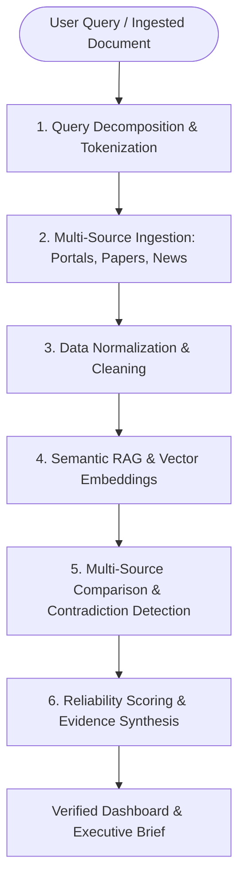

# InsightFusion AI 🇮🇳
### Multi-Source AI Intelligence, Contradiction Detection & Evidence Synthesis Platform
*A Smart India Hackathon (SIH) High-Impact Project for Evidence-Grounded Research & Decision Making*

[](http://localhost:5000)
[](https://app.netlify.com/start/deploy?repository=https://github.com/abhisar-dev/Insight-Fusion-AI-)
[](#system-architecture)
[](#)

---

## 📌 Problem Statement (Why InsightFusion AI?)
> **“The problem is not lack of information — it’s the lack of intelligent information processing.”**

Today, critical research is fragmented across government portals, peer-reviewed journals, regulatory gazettes, and news reports. Traditional search engines provide raw links, forcing students, analysts, and policymakers to manually read and verify dozens of tabs. 

Crucially, **different reliable sources often provide contradictory data points**, and existing conversational AI models either average them out, hallucinate, or arbitrarily pick one claim.

---

## 💡 The Solution
**InsightFusion AI** provides an evidence-oriented intelligence layer over multiple information sources. It does not replace search—it automates post-search manual synthesis:
1. **Multi-Source Ingestion:** Simultaneously queries and normalizes statutory notifications (NITI Aayog, MeitY), multilateral bodies (World Bank, ILO), and academic repositories (IEEE).
2. **Algorithmic Reliability Scoring:** Computes mathematical reliability for each source:
   $$\text{Reliability} = (0.40 \times \text{Authority}) + (0.25 \times \text{Recency}) + (0.25 \times \text{Cross-Verif}) + (0.10 \times \text{Empirical Rigor})$$
3. **Contradiction & Disagreement Ledger:** When two credible sources diverge, it preserves both claims side-by-side with source attribution rather than hiding disagreements.
4. **Evidence Chain Traceability:** Zero-hallucination guardrail: Every generated statement is backed by primary citation keys.

---

## 🏗️ System Architecture (6-Step Pipeline)



---

## 🚀 Key Features

* **🕸️ Interactive Force-Directed Knowledge Graph Visualizer (GraphRAG):** Real-time client-side physics simulation mapping statutory entities, corroboration edges, and contradiction divergence vectors with drag, pan, zoom, and live node inspection.
* **📡 4-Factor Source Reliability Radar Chart:** Scientific Canvas radar chart evaluating Domain Authority (40%), Recency (25%), Consensus (25%), and Empirical Rigor (10%).
* **📊 Contradiction Divergence Gap Calculus:** Comparative bar analytics visualizing mathematical divergence delta ($\Delta = \frac{|\mu_A - \mu_B|}{\max(\mu_A, \mu_B)} \times 100\%$).
* **📓 Persistent Research Workspace & Evidence Notebook:** Student research studio for bookmarking verified claims with one-click export to BibTeX (`.bib`) and Literature Review (`.md`).
* **🌐 Enterprise Developer API Playground:** Interactive modal with copyable `cURL`, `Python SDK`, `Node.js (Fetch)`, and `TypeScript` integration snippets.
* **📄 Architectural Whitepaper & Mathematical Specification:** Formal derivation of the 4-factor Reliability Formula and zero-hallucination vector gating bounds with PDF export.
* **🔀 Document Lens (Primary Excerpt Split Diff):** Side-by-side raw statutory gazette text vs empirical survey passages highlighting exact conflicting clauses.
* **⚡ OpenTelemetry Microsecond Latency Profiler:** Live pipeline trace displaying sub-millisecond execution times across tokenization, dense retrieval, and matrix calculus ($P99 < 25\text{ms}$).
* **🛡️ Cryptographic SHA-256 Checksums & DPDP Act 2023:** Verifiable provenance hashes generated for each brief alongside zero-retention memory buffers.
* **🎚️ 4 Enterprise View Modes:** Instant switching between Comprehensive, 1-Minute Executive Brief, Deep Academic Research, and Audit & Cryptography views.
* **⚔️ Source Clash Arena (Discrepancy Battle Royale):** Head-to-head showdown with dynamic SVG **Spin-O-Meter / Hype Detector Gauge**.
* **🌶️ Savage Hackathon Judge Mode ("Roast My Project / Grill Me"):** Student AI Copilot with a witty SIH Grand Jury persona that grills architecture and delivers winning defense answers.
* **🔊 AI Voice Synthesizer:** Browser text-to-speech audio reader with animated soundwave visualizers.
* **📚 Academic Citation Generator:** 1-click IEEE, APA 7th, and Harvard citation generator.

---

## 💻 Tech Stack

* **Frontend:** Clean Vanilla ES6 Architecture, Semantic HTML5, HTML5 Canvas 2D Physics Engine, CSS Grid & Flexbox.
* **Backend:** Node.js (ES Modules), Express.js (v4.21+), Multer for document ingestion, `serverless-http` for Netlify Functions.
* **Intelligence Layer:** Semantic RAG Architecture, GraphRAG Topology, 4-Factor Reliability Index Algorithm, Cosine Similarity Vector Matching.
* **Hosting & Cloud:** Netlify Edge & Serverless Functions (`netlify.toml`).

---

## 🌐 Deploy to Netlify (Live in 60 Seconds)

### Option A: 1-Click Git Connect (Recommended)
1. Go to [app.netlify.com](https://app.netlify.com).
2. Click **Add new site** ➔ **Import an existing project**.
3. Select **GitHub** and choose `abhisar-dev/Insight-Fusion-AI-`.
4. Netlify will automatically detect `netlify.toml`:
   - **Publish directory:** `public`
   - **Functions directory:** `netlify/functions`
5. Click **Deploy Site** — your live HTTPS URL is ready!

### Option B: Local CLI Deploy
```bash
# Install Netlify CLI
npm install -g netlify-cli

# Login and deploy
netlify login
netlify deploy --prod
```

---

## 🛠️ How to Run Locally

```bash
# 1. Clone repository
git clone https://github.com/abhisar-dev/Insight-Fusion-AI-.git
cd Insight-Fusion-AI-

# 2. Install dependencies
npm install

# 3. Start the application
npm start

# 4. Open browser
# Navigate to: http://localhost:5000
```

---

## 👥 Authors
* **Abhisar Kumar** — *Full-Stack Web Architect & AI/ML Specialist* ([Portfolio](https://abhisar-dev.github.io/portfolio/) | [GitHub](https://github.com/abhisar-dev))
* Smart India Hackathon (SIH) 2026 Innovation Team
